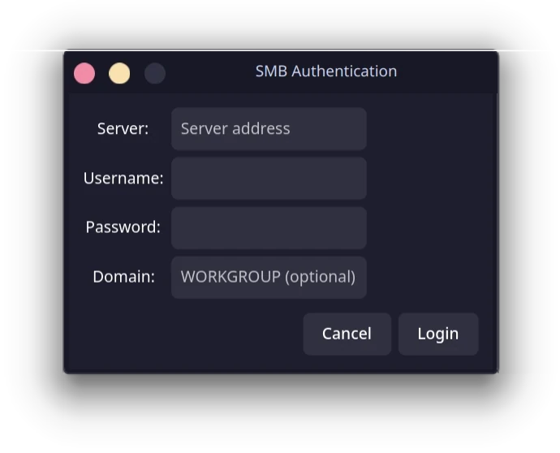
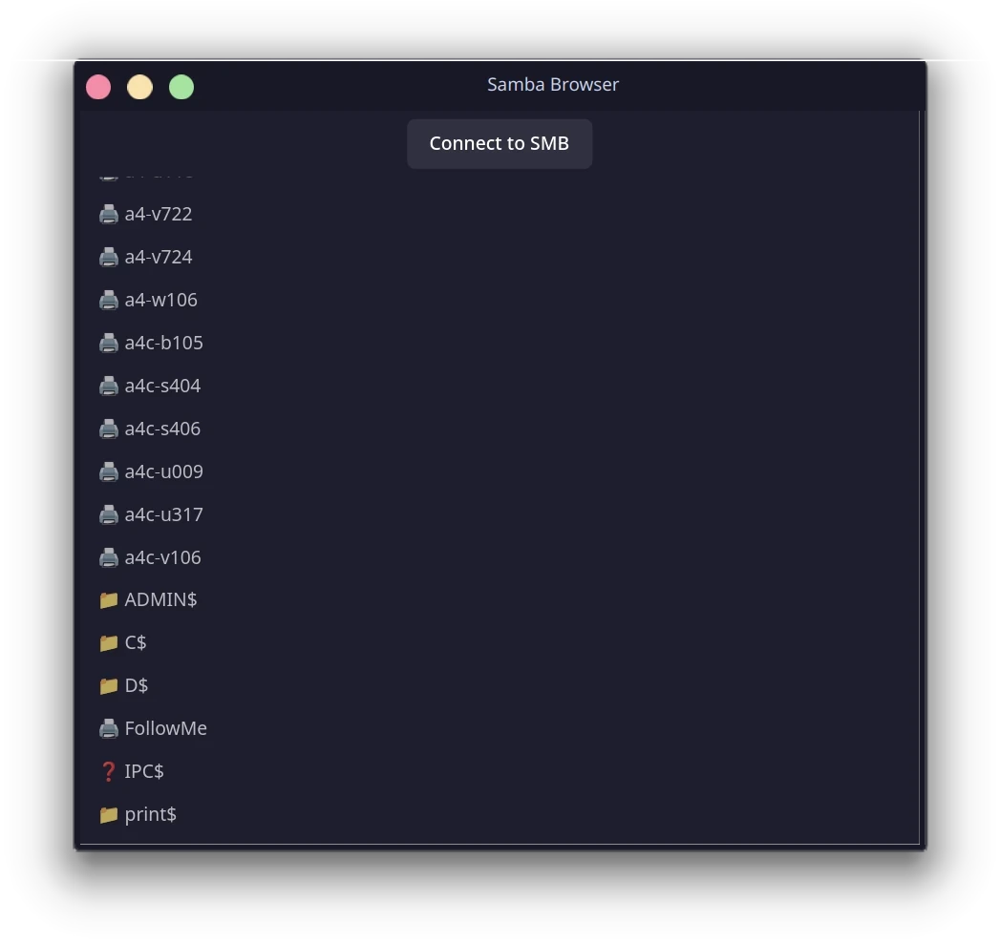
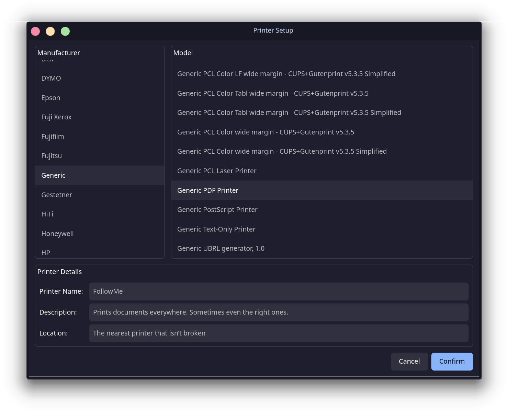

# Samba Printer Finder
A GTK4 application written in Rust that discovers and lists SMB (Samba) printers available on the local network.

It is also small project for me to learn Rust.
So, the code might be ugly, but for now it works... at least most of the time.
It is still in early development, so expect bugs, crashes, and missing features.

DO NOT use this in production or expect it to work flawlessly.


## Table of contents
- [Overview](#overview)
- [Installation status](#installation-status) 
- [Features](#features)
- [Build requirements](#build-requirements)
  - [Ubuntu/Debian](#ubuntudebian)
  - [Fedora](#fedora)
  - [Arch Linux](#arch-linux)
  - [MacOS (Homebrew)](#macos-homebrew)
- [Build instructions](#build-instructions)
- [Platform notes](#platform-notes)
- [Roadmap](#roadmap)
  - [Missing features](#missing-features)
  - [Not planned](#not-planned)

## Overview
Samba Printer Finder focuses on one thing: discovering SMB printers on your Network and letting you install them through a simple GTK4 UI.
Nothing more, nothing less.


## Installation
Prebuilt binaries are available for Linux (AppImage and deb) and MacOS (dmg) on the [GitHub Releases page](https://github.com/jgr1585/SambaPrinterFinder/releases).


If you prefer to build from source, see the [Build instructions](#build-instructions) section below.

## Features
- Connect to SMB shares using provided credentials.

- Display printer names and their network addresses in a GTK4 interface.

- Select a printer, alter its properties and install it using CUPS.


## Build requirements
You need the following dependencies installed on your system:
- Rust (latest stable version)
- GTK4 development libraries (https://gtk-rs.org/gtk4-rs/stable/latest/book/installation.html)
- CUPS development libraries
- Samba development libraries
- 
### Ubuntu/Debian
```bash
sudo apt install libgtk-4-dev libcups2-dev libsamba-dev build-essential
```

### Fedora
```bash
sudo dnf install gtk4-devel cups-devel samba-devel gcc
```

### Arch Linux
```bash
sudo pacman -S gtk4 cups samba base-devel
```

### MacOS (Homebrew)
```bash
brew install gtk4 cups samba
```

## Build instructions
1. Clone the repository.
2. Navigate to the project directory.
3. Build the project using Cargo: `cargo build --release`
4. Run the application: `cargo run --release`

## Platform notes
### Windows
Windows is not officially supported.
You may be able to build and run the application using WSL2, but this is untested.
Just use the Windows file explorer, it has almost feature parity with this application, except for a nice GTK4 interface.

## Roadmap
### Missing features
- Better error handling and user feedback (currently errors are logged to the console only).
- UI/UX improvements.
- Workgroup selection (currently a placeholder).
- Save SMB credentials securely to avoid prompting on every start.
- Localization and internationalization support.
- Unit tests and integration tests.
- Packaging:
  - AppImage and Flatpak are first priority for Linux.
  - Deb/RPM packages are possible.
  - AUR package for Arch Linux could be created in the future.
  - macOS: no plans yet, but .dmg or Homebrew formula could be considered.
  - Snap: Just... no...
- Load custom PPD files for printers without built-in CUPS support.

## Not planned
- Support for non-SMB printers (IPP, LPD, etc.).
- Advanced printer management (default printer, print jobs). Use system settings.
- Deleting/uninstalling printers. Use system settings.
- Libadwaita support. If this really bothers you, PR are open.

## License
See [LICENSE](LICENSE).